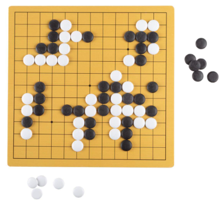
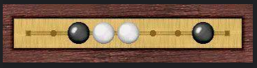
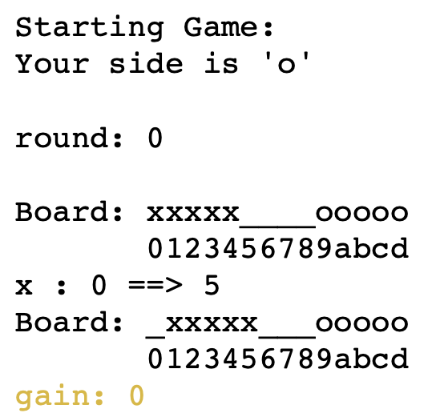
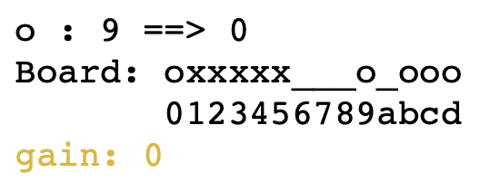
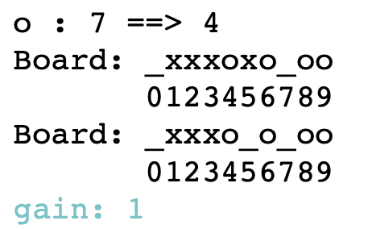
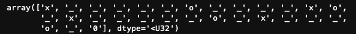
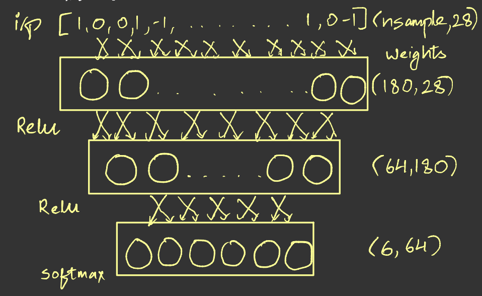
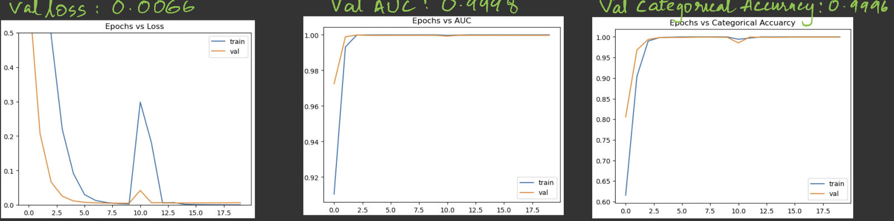
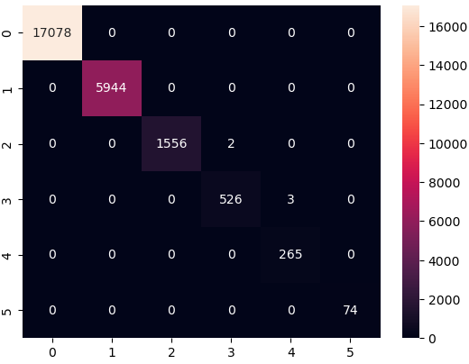

# Alak(1D_Go)
1D version of ancient Chinese game "Go" also called as "Alak"  
------------------------------------

## 1. Go & Alak

* `Go` is an abstract stategy board game for two players in which the aim is to surround more terriority than the oponents.
* The game was invented in China more than 2,500 years ago and is believed to the oldest board game continuosly played to the present day. 
* The playing pieces are called `stones`, one player uses the white stones and the other black.
* Interesting point in the history of `Go` is the day when `Deep Mind with the power of AI/ML built a model that defeated the legendary player Lee Sedol(9 Dan)` with a model called [AlphGo Documentary](www.google.com)
* `Alak` is a 1D version of Go with similar game play.

## 2. Rules and Simulation for Alak
* There are two sides: the “x” side and the “o” side.
* Starting board configuration: there are 5 pieces lined up on either side and 14 spaces total, i.e., 4 empty spaces between the two groups.
* You can move one piece at a time.
* You cannot add any new pieces to the board.
* The “x” side always makes the first move.
* Kill: if and only if one or more contiguous pieces on one side is “sandwiched” between two opposing pieces, then the “sandwiched” piece(s) will be removed from the board.
* Randomly generate the next legal move.
* Decide if any pieces need to be removed from the board.
* The opposite side makes its move.
* Show the positions of the pieces in each round of simulation (0 to 13), by using 0-9 and lower case ‘abcd’. Here’s the opening round of a simulated game:

 
    

* When a move results in a kill, in the verbose mode, you should show the board immediately after the move and again show the board after the killed pieces are removed, as shown in this example:

* Repeat until one side wins (the other side should have zero or one piece on the board)
* Save all the rounds (each round consists of two moves, one by each side) of the simulated game in a pickle file if you use sklearn, or a file type of your choosing if you use TensorFlow (usually .keras or .h5).
* Suicide moves are not allowed.

## 3. Technology Stack
Functionality  | Tools|
------------- | -------------|
Programming Language  | Python3|
Scientific Modules | numpy, matplotlib/seaborn|
ML Modules | sklearn, Tensorflow|
Deployment | Jupyter Notebook/Docker|

## 4. Dataset
* It consists of board positions gathered over 10,000 random winning games for both sides 'x' and 'o'.
* There are a total of `~25,000 games` with 90% training data and 10% testing data.
* Data Sample:

## 5. Architecture

* Multi layer fully connected layers with 6 different outputs.
* Each output tells the number of kills after making a particular move, maximum kills one can attain is 5 hence 0-5, 6 different outputs.

## 6. Algorithm (Greedy2Greedy Algorithm)
* Generate data using 10,000 random games(random games avoid suicide moves to learn strong moves).
* Encode the data from 'x','o' -> '1' and '-1'.
* Train the model using these games with 90%-10% split.
* Make predictions using the trained model.
* Get indexes of the move with maximum winning probability i.e. 0-5 kills.
* Iterate from 5 kills to 0 kills and the return the first move over threshold of default value 0.8, hence the name `G2G Algorithm`
* If none of the moves are over threshold, return the move with maximum probability.

## 7. Results:

* The trained model converges in less than 20 epochs with:
Metrics | data | Result|
---| --- | ---|
Categorical Cross Entropy loss |val|0.0066|
Area Under Curve|validation|0.9998|
Categorical Accuracy|validation|0.9996|
* The data would be highly skewed with majority of vaules for 0 kills and very few for 5 kills, hence used weighted training for training the model with following weights
    * Weight for class 0: 0.74
    * Weight for class 1: 2.14
    * Weight for class 2: 8.34
    * Weight for class 3: 23.75
    * Weight for class 4: 52.53
    * Weight for class 5: 190.80
* Confusion Matrix:

## 8. Different Components
Folder | data | Usage|
---| --- | ---|
src |**Alak2.py**|root script for playing and generating the data|
notebooks|**alak_simul.ipynb**|refer notebook for generating data, training and playing the game|

## 9. Contribution
* [Shrikant Kendre](https://github.com/shriawesome/)
